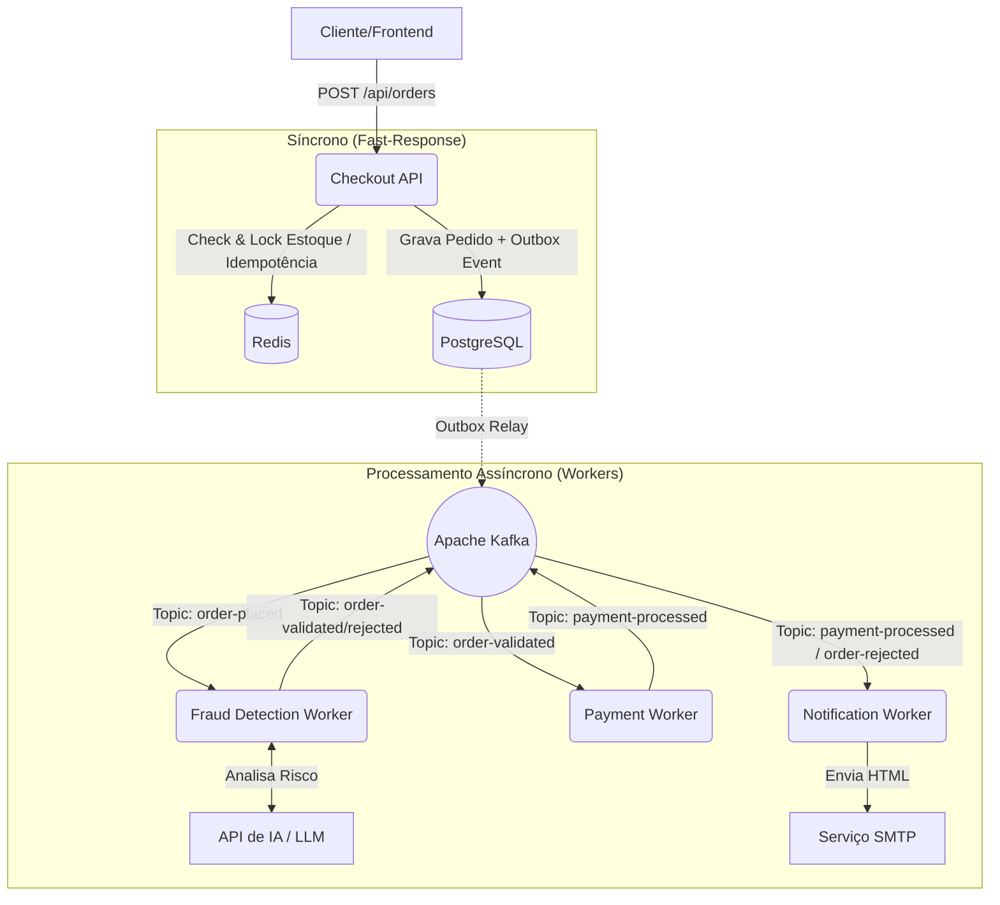

# 🚀 Asynchronous Order Processing Pipeline


## 📌 Sobre o Projeto
Este projeto é uma Prova de Conceito (PoC) de uma **Arquitetura Orientada a Eventos (EDA)** voltada para e-commerces de alto tráfego. O objetivo principal é demonstrar como desacoplar processos críticos de negócio (como análise antifraude, pagamentos e notificações) do fluxo principal de checkout do usuário, garantindo alta disponibilidade, resiliência e performance.

O sistema recebe milhares de intenções de compra simultâneas, responde rapidamente ao cliente e processa as regras de negócio em background de forma distribuída.

## 🏗️ Arquitetura e Fluxo de Dados

O ecossistema é composto por microsserviços independentes que se comunicam exclusivamente via **Apache Kafka**.



## 🧠 Padrões de Arquitetura Implementados

Para garantir que o sistema distribuído seja robusto e à prova de falhas, os seguintes padrões de engenharia de software foram aplicados:

*   **Event-Driven Architecture (EDA):** Comunicação assíncrona baseada em eventos, reduzindo o acoplamento temporal entre os serviços.
*   **Transactional Outbox Pattern:** Garante consistência eventual entre o banco de dados da API e o Message Broker. O evento só é publicado no Kafka se a transação do banco for commitada com sucesso.
*   **Saga Pattern (Coreografia):** Gerenciamento de transações distribuídas. Cada serviço reage a um evento, processa sua regra e emite um novo evento. Falhas disparam eventos de compensação (Ex: estornar limite, devolver item ao estoque).
*   **Idempotência com Redis:** Protege a API contra requisições duplicadas (Double Submit) garantindo que, mesmo que o cliente clique duas vezes, o processamento ocorra apenas uma vez.
*   **Rate Limiting & Caching:** Utilização do Redis para aliviar a carga no banco de dados relacional.

## 📦 Estrutura dos Microsserviços

1.  **Checkout.API**: Ponto de entrada. Valida payload, checa estoque no cache (Redis), salva o pedido como pendente e gera o evento `OrderPlaced`.
2.  **FraudDetection.Worker**: Consome novos pedidos, integra com uma **Inteligência Artificial (IA)** para analisar o score de risco da transação e aprova/rejeita o pedido.
3.  **Payment.Worker**: Simula um gateway de pagamento. Se aprovado, debita o valor e confirma a compra.
4.  **Notification.Worker**: Serviço utilitário que escuta o barramento de eventos e dispara **E-mails transacionais** (HTML formatado) informando o usuário sobre o status do pedido.

## 🚀 Como executar localmente (Docker)

**Pré-requisitos:** Docker e Docker Compose instalados.

1. Clone o repositório:
```bash
git clone https://github.com/jose-meurer/ecommerce-async-pipeline.git
cd ecommerce-async-pipeline
```

2. Suba a infraestrutura (Kafka, Redis, PostgreSQL):
```bash
docker-compose up -d
```

3. (Opcional) Execute as APIs/Workers via Visual Studio, Rider ou CLI:
```bash
dotnet run --project src/Checkout.API/Checkout.API.csproj
```

## 🛠️ Stack Tecnológica
*   **Backend:** C# 12, .NET 8, ASP.NET Core Web API, Worker Services
*   **Mensageria:** Apache Kafka (Confluent)
*   **Banco de Dados & Cache:** PostgreSQL (Entity Framework Core), Redis
*   **Integrações:** OpenAI/Gemini API (Antifraude), MailKit/SMTP (E-mails)
*   **Infra:** Docker, Docker Compose
